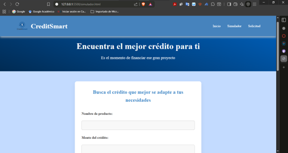
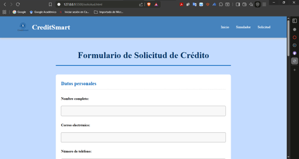

# CreditSmart_INGWEB1
Proyecto integrador del curso de ingeniería web l de la IU Digital de Antioquia

## 👤 Nombre estudiante
**Anderson Lopera Rodríguez**

---

## 🏦 Descripción breve del proyecto

**CreditSmart** es una página web informativa y funcional que presenta una interfaz sencilla para que los usuarios conozcan los tipos de créditos disponibles y realicen solicitudes en línea.  
El proyecto está diseñado con HTML y CSS puros, sin frameworks ni JavaScript, buscando una estructura clara, moderna y accesible.  

El sitio cuenta con:
- Una página principal con el menú de navegación y banner institucional.
- Un carrusel de productos (tipos de crédito) organizado visualmente.
- Una página de simulador para calcular montos aproximados.
- Una página de solicitud con formulario de registro dentro de una caja limpia y centrada.

---

## 📂 Estructura de archivos

    📂 Actividad 1

        📂CSS
            📄styless.css

        📂Images
            🖼️Imagen1.png
            🖼️Imagen2.png
            🖼️Imagen3.png
            🖼️Logo.png

    📄1. Actividad_1.pdf
    📄index.html
    📄README.md
    📄simulador.html
    📄solicitud.html
    📄Solo activiad 1.pdf

## ⚙️ Instrucciones para ejecutar el proyecto

1. Descarga o clona el repositorio del proyecto.  
2. Asegúrate de mantener la misma estructura de carpetas.  
3. Abre el archivo **`index.html`** en tu navegador web (doble clic o clic derecho → *Abrir con* → *Navegador* o *VS code*).  
4. Navega por las páginas desde el menú superior:
   - **Inicio:** presentación y tipos de crédito.  
   - **Simulador:** formulario para buscar el mejor crédito.  
   - **Solicitud:** formulario para enviar la solicitud del crédito requerido.  

---

## 🖼️ Capturas de pantalla

### 🏠 Página principal (Inicio)

### 📊 Simulador de crédito

### 📝 Formulario de solicitud

